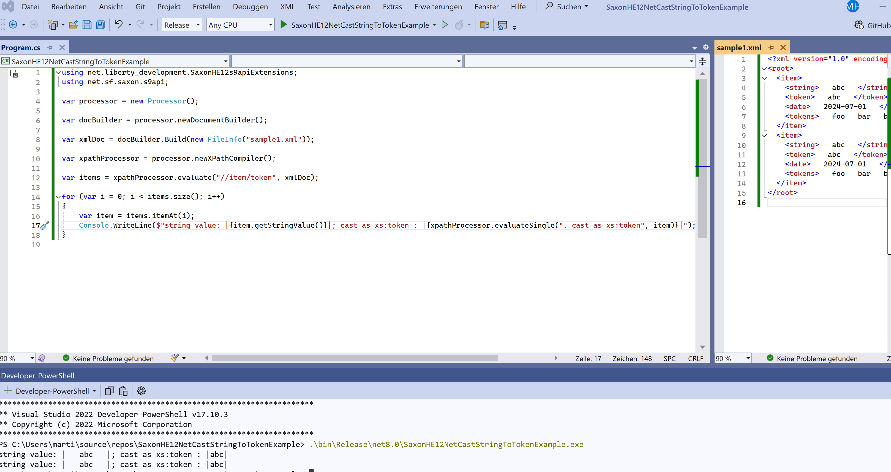

# Using Saxon HE 12 with XPath 3.1 to cast an element value to xs:token

This is a sample project using Saxon HE 12 Java cross-compiled to .NET to select some elements valus with XPath 3.1 and cast them to an xs:token.

